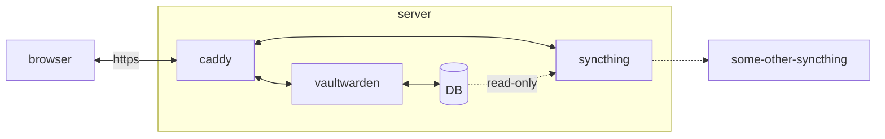

# Selfhosted

Ansible playbooks for setting up Vaultwarden on a fresh server, with some bells an whistles.

## Getting started
### requirements
1. a server where you want the system to be hosted
    1. with root-access
    1. with IP-address (public or local)
    1. with at least 1GB of RAM
1. a duckdns-account
    1. with the preferred URL registered to the servers-IP
1. a local machine that can run ansible

### running
You need to run two scripts in order to set-up the server...
1. `bash ./set-up.sh` - to set-up the local machine and vault the secrets.
1. `bash ./run.sh` - to set-up the server, it will take about 20 mins.

If you want to see what is in your vault you can run `bash check-vault.sh`.

### setting up syncthing
Go to syncthing on https://YOURSUBDOMAIN.duckdns.org/syncthing/ and start syncing your folder. Perhaps with another friend who also has this set-up?

### start using vaultwarden
You are now all done! Go to https://YOURSUBDOMAIN.duckdns.org/vaultwarden/ and start adding passwords.

## TODO:
- improve readme
- add script for clean-up vault
- improve docker-build (no longer 1GB RAM needed)
- set-up syncthing on localhost as well?
- mac-OS?
