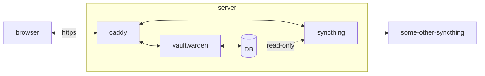

# Selfhosted

Ansible playbooks for setting up Vaultwarden on a fresh server, with some bells an whistles.

TODO:
- improve readme
- test everything on a fresh server
- future: set-up syncthing on localhost as well?
