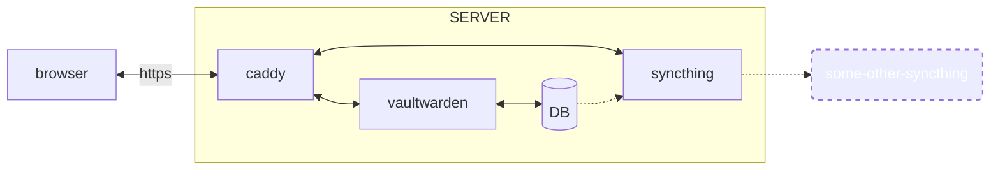

# Selfhosted

[Ansible playbooks](https://docs.ansible.com/ansible/latest/index.html) for setting up [Vaultwarden](https://github.com/dani-garcia/vaultwarden) password manager on a fresh server. Adding - [basic](https://github.com/geerlingguy/ansible-role-security#ansible-role-security-basics) - security.

## Tools & Architecure

[docker-compose]() - running the applications on the server.

[Caddy](https://github.com/caddyserver/caddy) - routing HTTP and for [HTTP challange](https://github.com/dani-garcia/vaultwarden/wiki/Using-Docker-Compose#caddy-with-http-challenge).

[Syncthing](https://github.com/syncthing/syncthing) - syncing data to a remote machine.[This is not backups that protects against corrupt data.](https://www.reddit.com/r/Syncthing/comments/fh98vn/why_is_syncthing_not_a_backup_solution/)

## Getting started
### Requirements
1. a server where you want the system to be hosted with...
    1. root-access
    1. IP-address
    1. at least 1GB of RAM
1. a registered domain pointing to the server
1. a local machine that can run ansible

### Running
You need to run two scripts in order to set-up the server...
1. `./set-up.sh` - to set-up the local machine and vault the secrets.
1. `./run.sh` - to set-up the server.

  
You can also run...

    - `./check-vault.sh` - to print your local ansible-vault
    - `./clean-up.sh` - to remove your local ansible-vault

### Setting up Syncthing
Go to syncthing on https://YOURDOMAIN/syncthing/ and start syncing your folder. Perhaps with another friend who also has this set-up?

### Start using Vaultwarden
You are now all done! Go to https://YOURDOMAIN/vaultwarden/ and start adding passwords. Or get started with some [Bitwarden-clients](https://bitwarden.com/download/) and connect them to your Vaultwarden.
